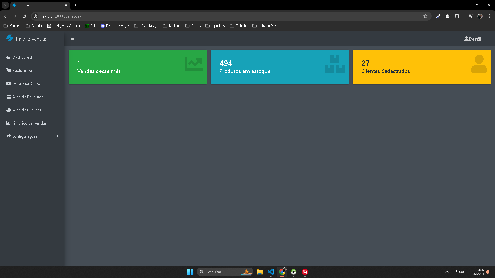
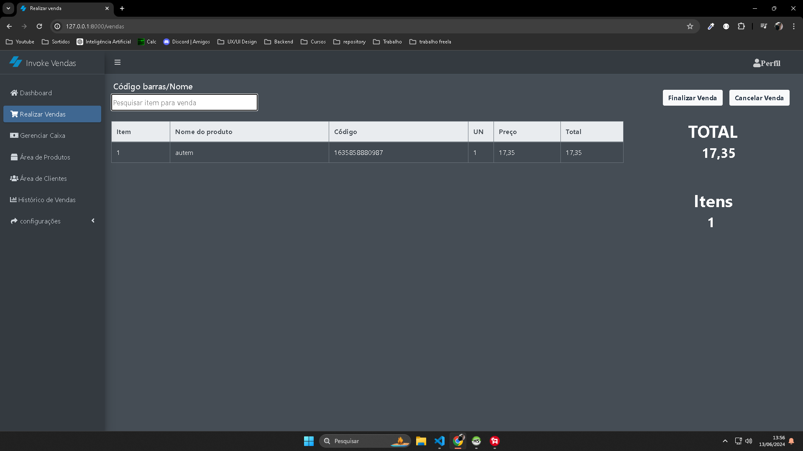
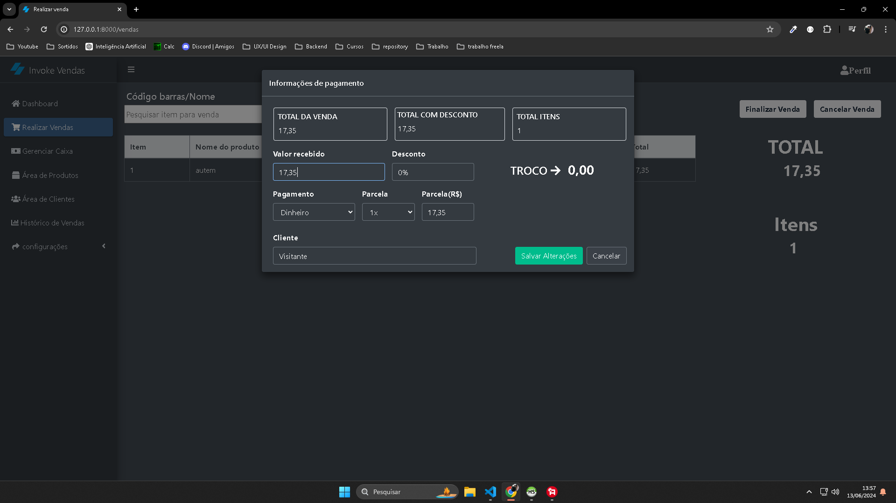
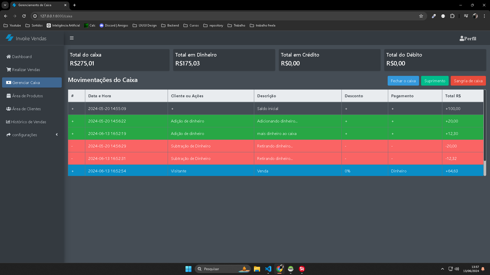
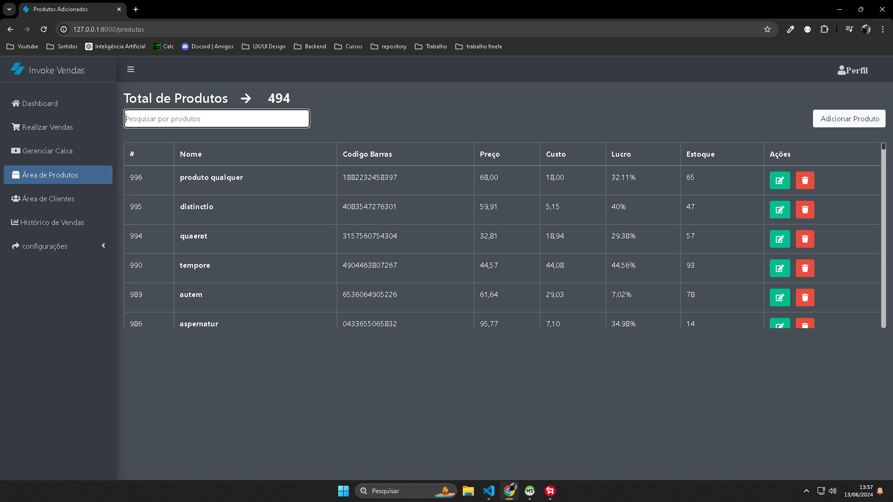
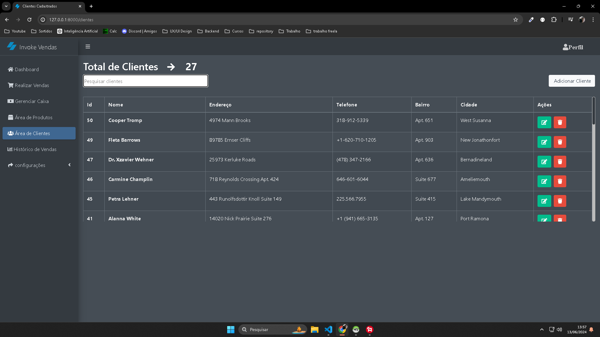
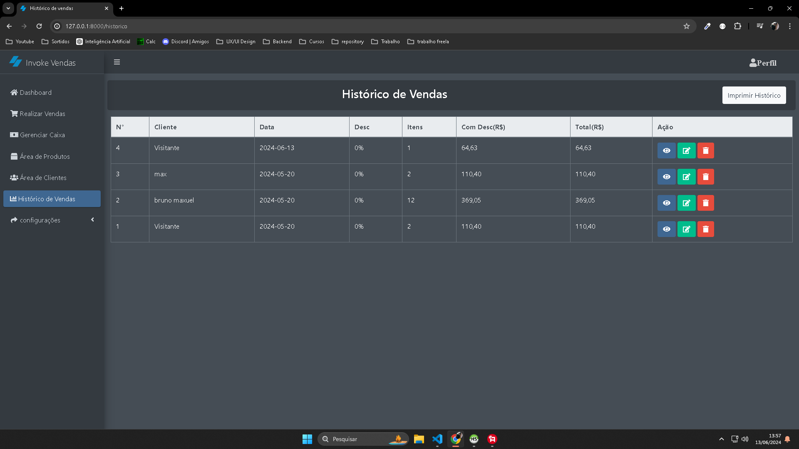
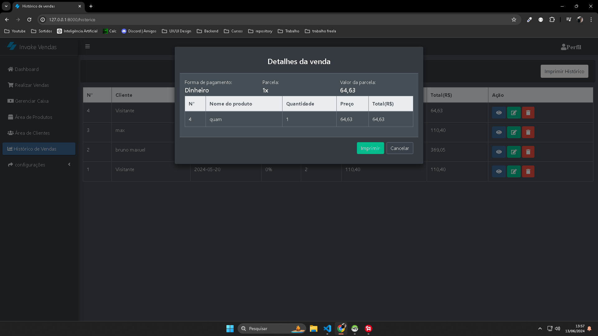
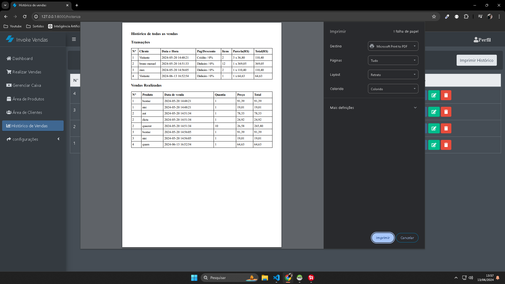

#                                                                                                Sistema de vendas web

## Sobre o sistema

- **Esse sistema é desenvolvido com Laravel, Bootstrap, Jquery, AdminLTE.**
- **Foi construido para realizar vendas de forma fácil e rápido.**
- **Possui a Área de vendas, com um input para pesquisar os produtos.**
- **Possui uma Tabela para os produtos pesquisado, existe outra para Listagem de venda.**
- **Possui a Área de clientes, há uma lista de clientes, você pode editar, excluir e adicionar clientes, com produtos é a mesma função.**
- **Possui a Área de backup do sistema, onde você pode restaurar os dados do sistema e também pode gerar um arquivo SQL de backup.**
- **Possui todo o histórico de vendas, mostra venda detalhada, editar forma de pagamento, você também pode imprimir dados da venda do mês.**
- **Possui autenticação de login.**
- **Possui migrations para preparar banco de dados rápido.**
- **Possui organização, sem executar regras de negócios no controller.**
## Instalação

- **Faça clone do projeto na Filial "develop": git clone -b develop https://github.com/BrunoMaxuel/pdv-zero.git**
- **Abra o projeto cd pdv-zero, execute "cp .env.example .env" e configure login e senha**
- **Execute "composer install" para instalar as dependências do composer.json e gerar a pasta vendor.**
- **Execute "sail up -d" ou "./vendor/bin/sail up -d" depende da configuração do docker.**
- **Execute "sail artisan migrate --seed" para criar as tabelas no banco e gerar dados fictícios.**
- **Faça login com "visitante@gmail.com" e senha "visitante123" para acessar o sistema.**

# demonstração

